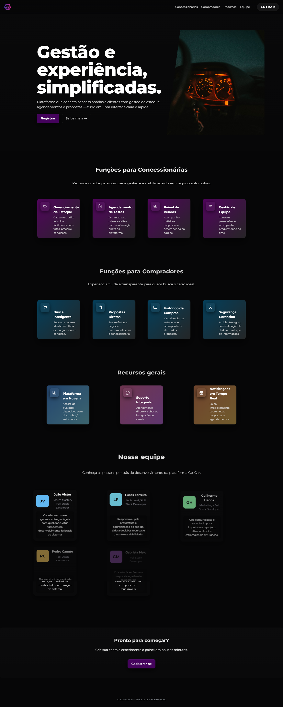
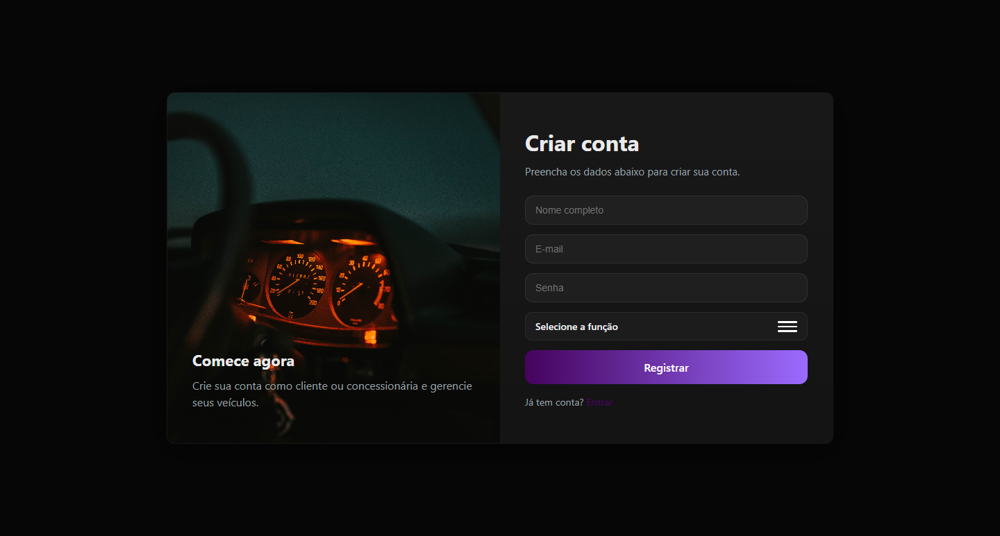
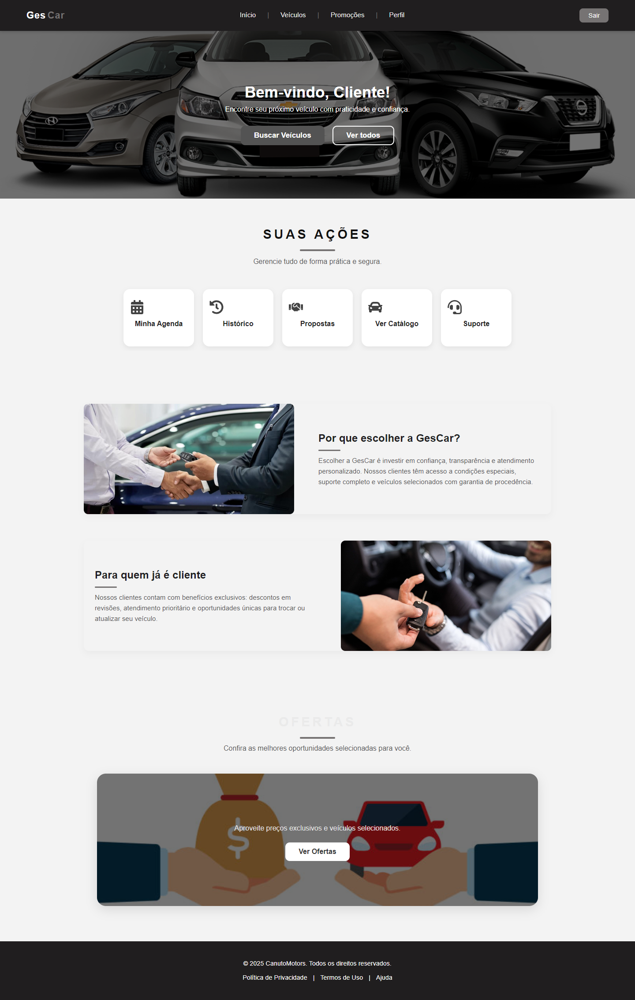
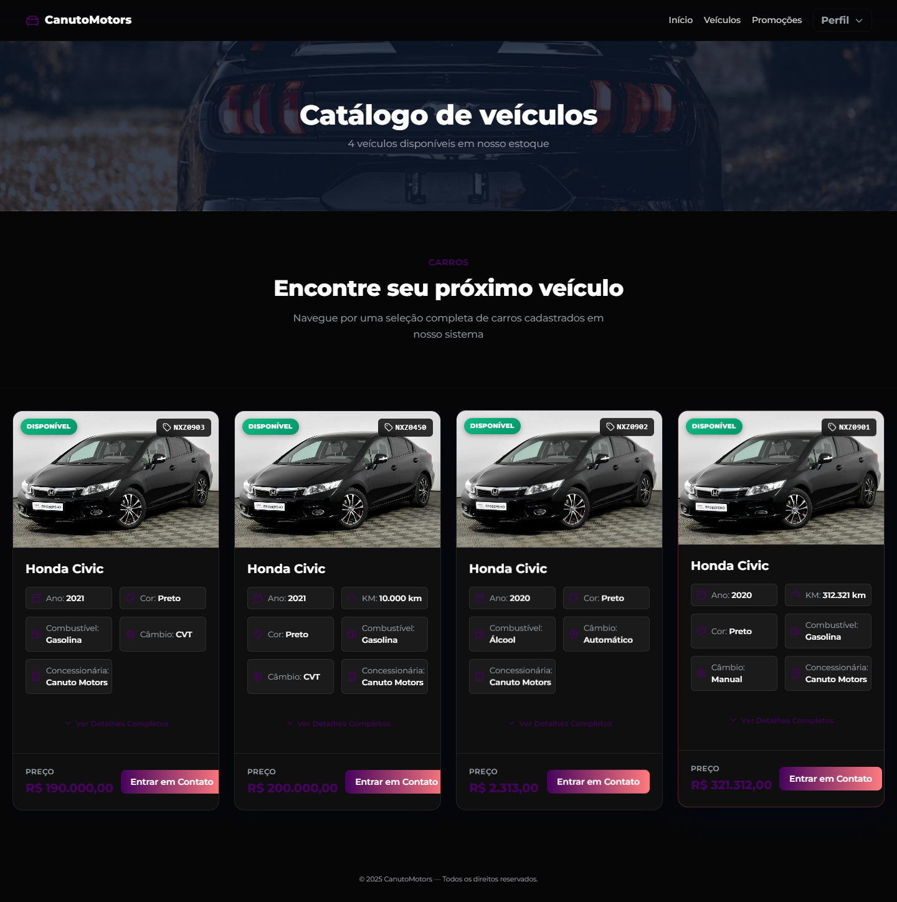
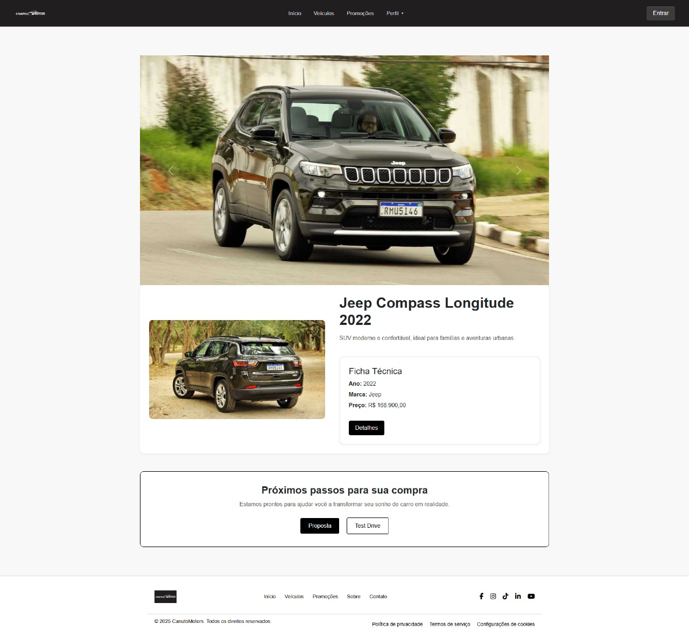
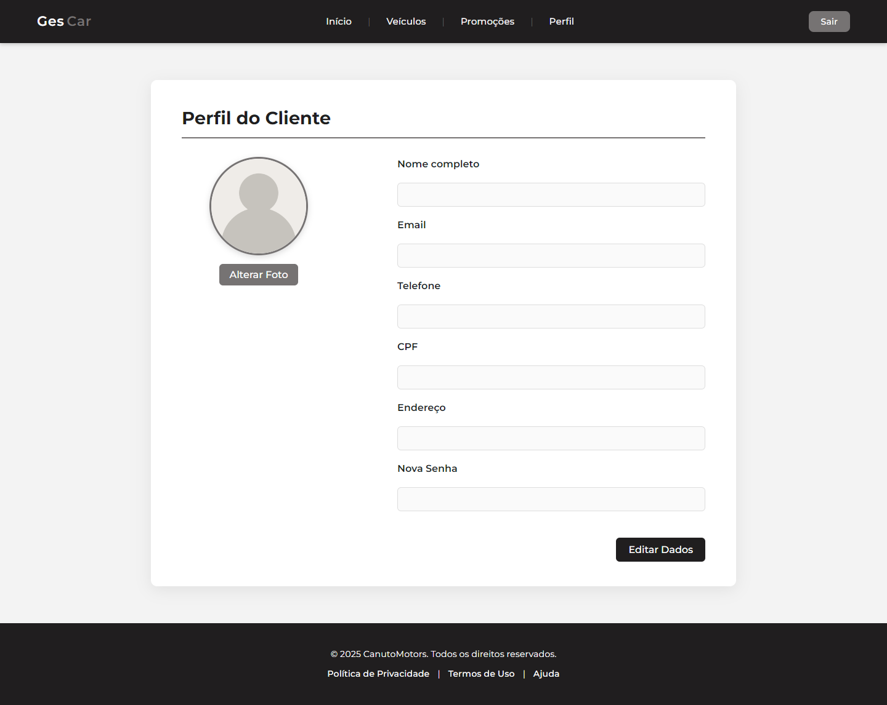
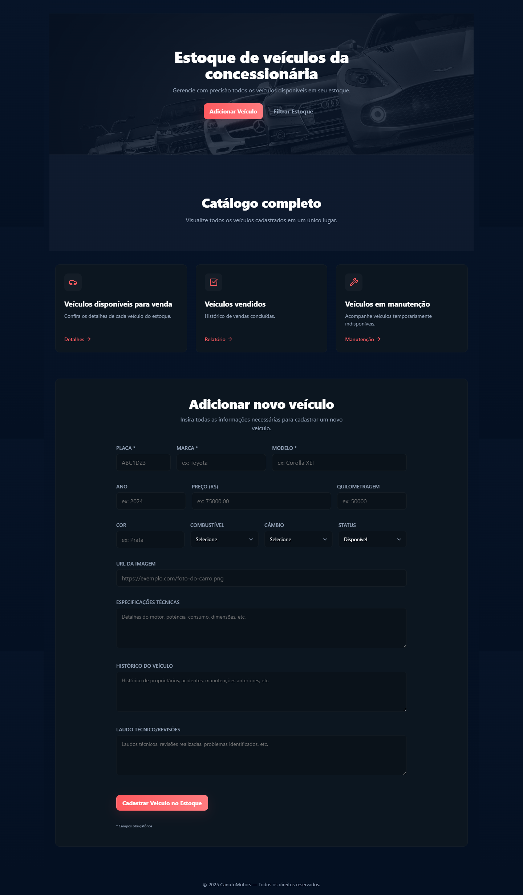
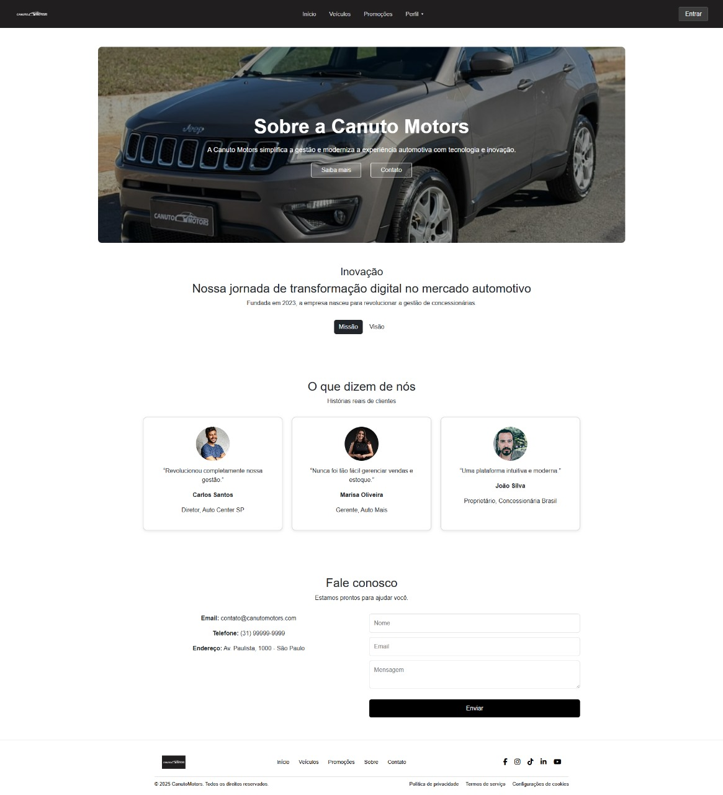

# 6. Interface do Sistema

Pré-requisitos: <a href="4-Projeto-Solucao.md"> Projeto da Solução</a>

Visão geral da interação do usuário por meio das telas do sistema. Apresentamos abaixo as principais interfaces da plataforma "Canuto Motors" desenvolvidas até a Sprint 4, demonstrando o fluxo principal e as funcionalidades implementadas.

## 6.1. Landing Page e Login

A porta de entrada do sistema, introduzindo a proposta de valor da plataforma e permitindo o acesso seguro dos usuários (clientes e concessionárias).

**Landing Page**
_Descrição: Tela inicial de apresentação da plataforma SaaS "Canuto Motors", destacando seus benefícios e funcionalidades principais._

**Tela de Login**
_Descrição: Formulário para autenticação de usuários (clientes e concessionárias), permitindo o acesso às áreas restritas do sistema._

## 6.2. Telas da Visão do Cliente

Interfaces focadas na jornada do cliente, desde a busca por veículos até a visualização de detalhes.

**HomePage (Cliente)**
_Descrição: Painel principal do cliente, apresentando destaques, veículos recém-adicionados e atalhos para o catálogo e perfil._

**Catálogo de Veículos (Cliente)**
_Descrição: Galeria de veículos disponíveis para venda, equipada com funcionalidades de busca e filtros (marca, preço, ano)._

**Detalhes do Veículo (Cliente)**
_Descrição: Visão detalhada de um veículo específico, exibindo informações completas, fotos, especificações e botão para contato (WhatsApp)._

**Perfil do Cliente**
_Descrição: Área restrita onde o cliente pode gerenciar suas informações pessoais, propostas enviadas e agendamentos._

## 6.3. Telas da Visão da Concessionária

Interfaces administrativas para que a concessionária possa gerenciar seu estoque e operações.

**HomePage (Concessionária / Dashboard)**
_Descrição: Painel de controle da concessionária, exibindo métricas rápidas (vendas, estoque) e acesso às ferramentas de gestão._

**Gestão de Estoque (Concessionária)**
_Descrição: Interface para cadastrar, editar, remover e gerenciar todos os veículos do inventário da concessionária._

**Tela Sobre (Concessionária)**
_Descrição: Página de configuração onde a concessionária edita suas informações públicas, como nome, endereço e descrição._

